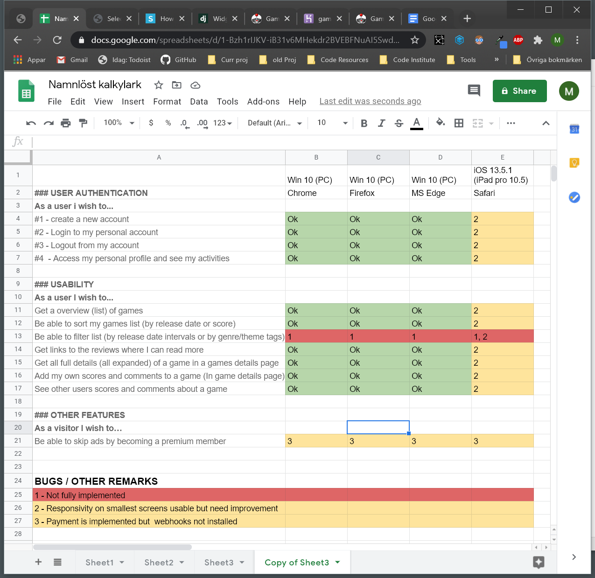

# GAME REVIEWS

## A game database - Game reviews meta scores

### A Code Institute student project

## SUMMARY

This project aims to build a computer and console- games reviews database. In its essence it will hold a list of recent games being released for PC, Xbox- and Playstation-consoles. Each game will have it's score presented, calculated from average review scores from popular gaming sites around the world. It will also hold a short summary of the game content, tags to describe genre and themes etc. Release date, developer, publisher, short quotes from the game sites and links to those review sites. Also links to sites where the games can be bought.

See this as a sort of portal for gamers where they can get quick and easy information about the most recent games (In time older games can be added to the db a well), and from where they navigate further to each of the real game review sites if interested or to a site where they actually can buy the game. It is a complementary service for gamers wishing to get some overview of what is available and what is to come.

Besides the Meta score derived from professional reviews, a user can also add their own score for a game and also further add their own comments to a game in a specific game details page. The score shown in the list will be filtered either purely based on the professional scores by default (possibly also purely on the users own scores, or all together). Each game should have it's own discussion board where users can share their scores, views and experience from that particular game.

## FEATURES

### List of games (Expanded view)

-   Game title
-   Thumbnail image
-   Release date
-   Developer / Publisher
-   Genre, theme tags
-   Pegi info image with link
-   Score (average% from game site reviews)
-   Platforms
-   Expandable game site quotes window (three random on top)
-   Short game description (expandable to show more)
-   Links (thumbnails) to buy sites (i.e Amazon)
-   Link to game details page
-   Collapse button
-   Add to favorites button

### List of games (Minimized view)

-   Game title
-   Small thumbnail
-   Score
-   Platforms
-   Genre, theme tags
-   Link to game details page
-   expand button

### Sorting and filtering

Sort by (dropdown)

-   Release date (Asc and desc) (Desc default)
-   Avg score (Asc and desc)

Show (dropdown)

-   Most recent (10 or 20 games) (Default)
-   All time
-   Last month
-   Last 3 month
-   Last 6 month
-   Last year

List size (Dropdown)

-   Only top three expanded (default)
-   All expanded
-   Minimized

Filter

-   A modal (or something like that) with checkboxes for all genre, theme tags (Ordered in some logical way) (No checked as default)

### Game details

A specific details page for each game.
Except for details described in list of games above

-   Detailed description
-   Full game site quotes
-   Users own scores and comments (discussion)

### User authentication

-   Register (Google)
-   Login (Google)
-   Logout
-   Personal page (Details like email, user/screen name, avatar picture, list of favorite games, replies to discussion posts made by user)

### Payment feature

For user wishing to become premium members (No adds and possibly some other content)

### Advertising containers

Top, right and possibly mixed in content

## USER STORIES

### Authentication / User details

As a user i wish to:

-   Register a new account
-   Log in to my account
-   Log out from my account
-   Access my personal profile and see my activities.

### Games information

As a user I wish to:

-   Get a overview (list) of games (name, release date score, genre, theme, developer/publisher, short critics quotes, game description)
-   Be able to sort my games list (by release date or score)
-   Be able to filter list (by release date intervals or by genre/theme tags)
-   Get links to the reviews where I can read more
-   Get all full details (all expanded) of a game in a games details page
-   Add my own scores and comments to a game (In game details page)
-   See other users scores and comments about a game (In game details page)

### Other features

As a user I wish to:

-   Be able to skip ads by becoming a premium member (payment per month)

## TECHNOLOGIES USED

-   HTML 5
-   CSS 3 (Bootstrap 4.5.0, Popper 16.0, fontawesome 5.13.1)
-   JAVASCRIPT (JQuery 3.5.1, popper 1.16.0, bootstrap 4.5.0)
-   Python 3.8.5
-   Postgres Db (deployed on Heroku)
-   Amazon AWS for media storage
-   Google Fonts
-   Font Awesome
-   GitHub for version control
-   Heroku for deployment
-   Visual Studio Code 1.46.1 as IDE
-   Google Chrome 84.0.4147.89 (and development tool)
-   GIMP 2.10.14 for image manipulation

On Heroku you need to set up a postgres db and add all required environment variables.

You also need somewhere to store media files. I use S3 from Amazon AWS.

## DEPLOYMENT

If you wish to deploy this project of your own take the following steps.

Clone this project to your own working directory:

1. In this repository (as you’re reading this readme in it :-) on the top right click the green “Code” button
2. Copy the given url by clicking on the copy icon (or open it up with GitHub Desktop if you have it installed)
3. In your local IDE open Git Bash (or whatever terminal you use to work with Git)
4. Change the current working directory to the location where you want the clone to be created
5. In the terminal type “git clone” and the paste the url you just copied
   Press Enter. Your local clone will be created in the working directory you’re currently in

## TESTING

The test is done manualy in the following browsers:

-   Google Chrome 84.0.4147.89 (on PC Windows 10)
-   Microsoft Edge Chromium 84.0.522.44 (on PC Windows 10)
-   Firefox 78.0.2 (on PC Windows 10)
-   Safari (on iPad pro 10.5 iOS 13.6.1)
-   The testing is done from the perspective of each user story (presented above) in regards of functionality and responsivity.

## UX

### Strategy / Business goal

The core business goal is to drive traffic that in turn can generate revenue streams from advertising and other affiliate programs (I.e Amazon). Users that wish to not get advertising messages can become premium members where they pay a monthly fee.

In order to get this traffic, the site of course needs to add value to the user. There are other sites existing doing some meta score presentation, but in my own opinion they always try to do too much, resulting in a bit confusing and messy experience where the overview is not that great. This site aims to be clean and simple. It is purely about gamers getting an overview of what games are available at the moment, what are they about, what genre and theme, what the professional critics think about them, what other gamers think about them etc. No more, no less. In that sense it should be clean of other clutter (except some necessary adds as part of the business model of course)

## CREDITS

### Media

Stadia image (as icon)
https://simpleicons.org/icons/stadia.svg

Joystick
https://www.pinclipart.com/pindetail/xhJmw_clip-art-black-and-white-download-file-gnome/

Landing image
freepik @ https://www.freepik.com/free-photo/close-up-blurred-guy-holding-controller_5121535.htm#page=1&query=game%20controller&position=18

User Avatars
Alex Gallego @ https://www.coroflot.com/alexgallego/Poker-player-game-avatars

Incognito Avatar Image
vecktorstock.com @ https://cdn1.vectorstock.com/i/1000x1000/50/30/user-icon-male-person-symbol-profile-avatar-vector-20715030.jpg

### Code

Extend user profile
https://simpleisbetterthancomplex.com/tutorial/2016/07/22/how-to-extend-django-user-model.html#onetoone

Stripe payment
Django Lessons @ https://www.youtube.com/watch?time_continue=110&v=Bq5lR5WQNOw&feature=emb_logo
