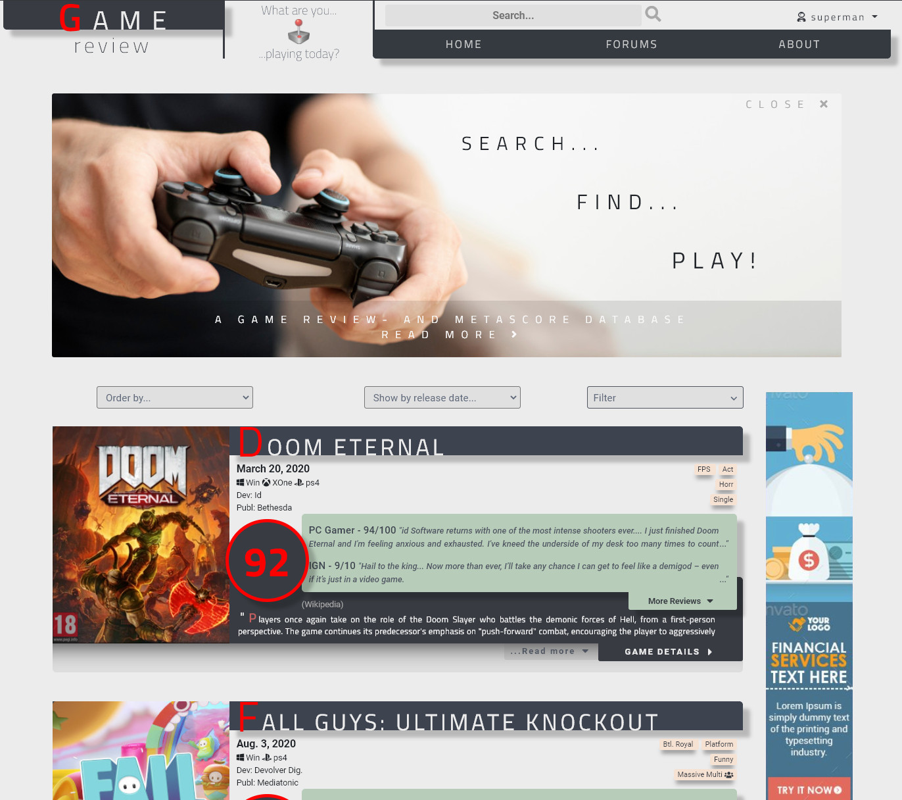
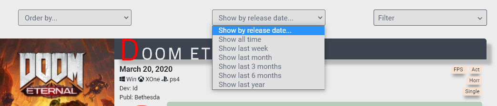
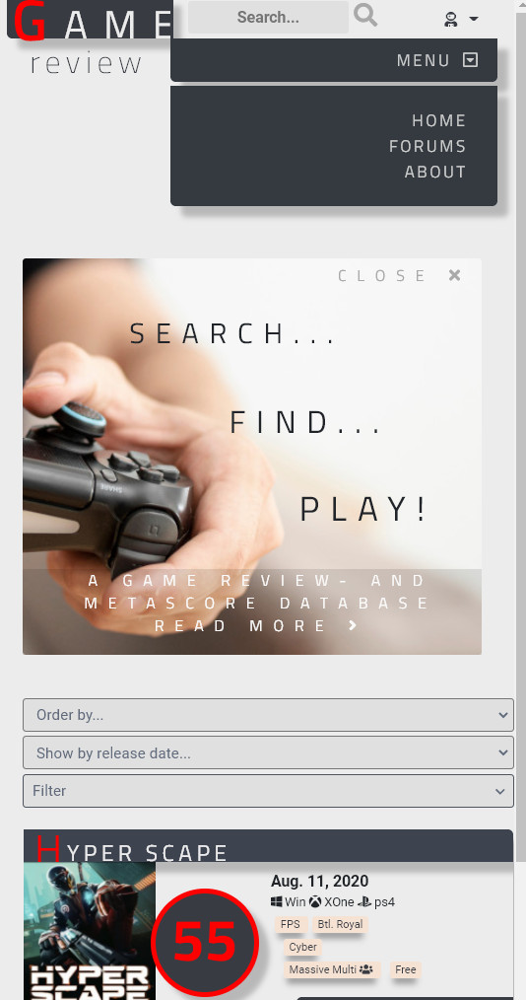
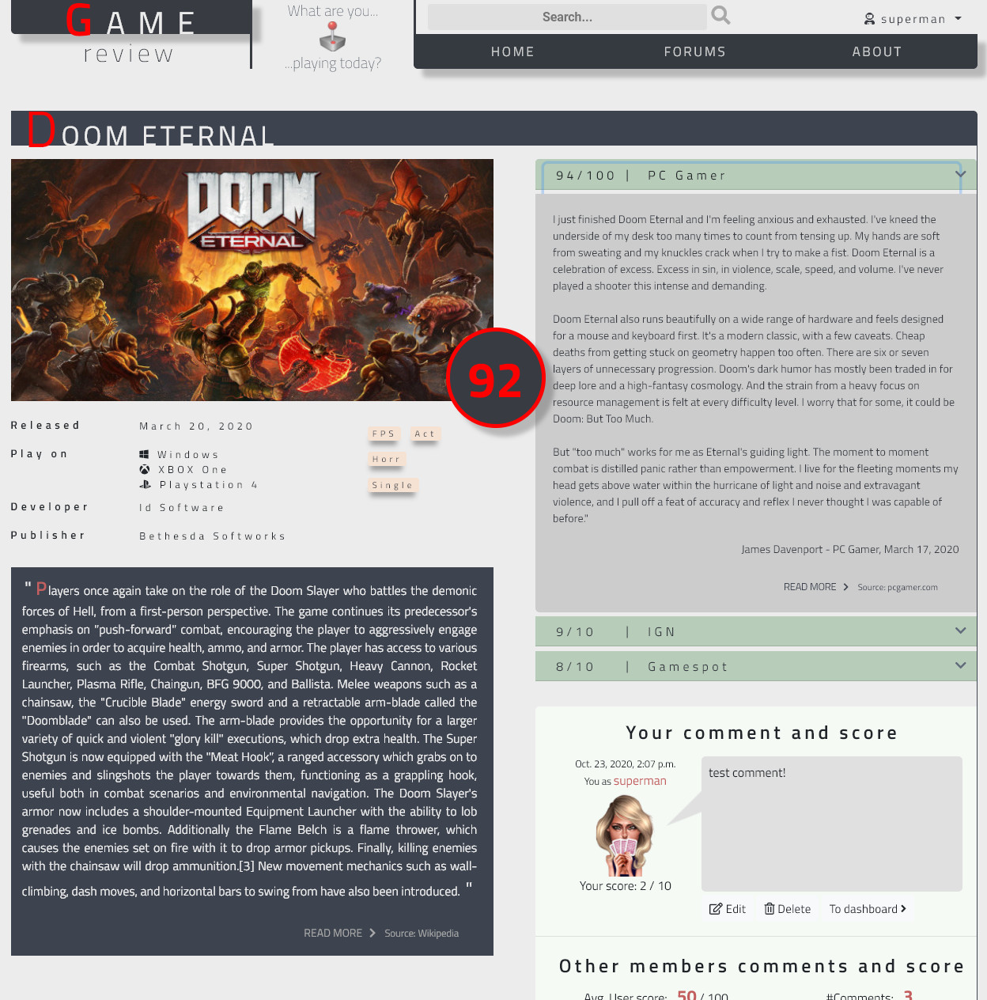
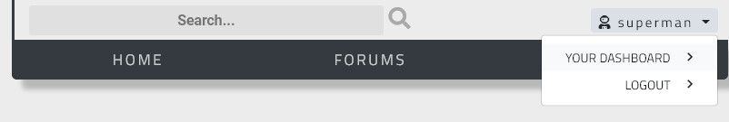
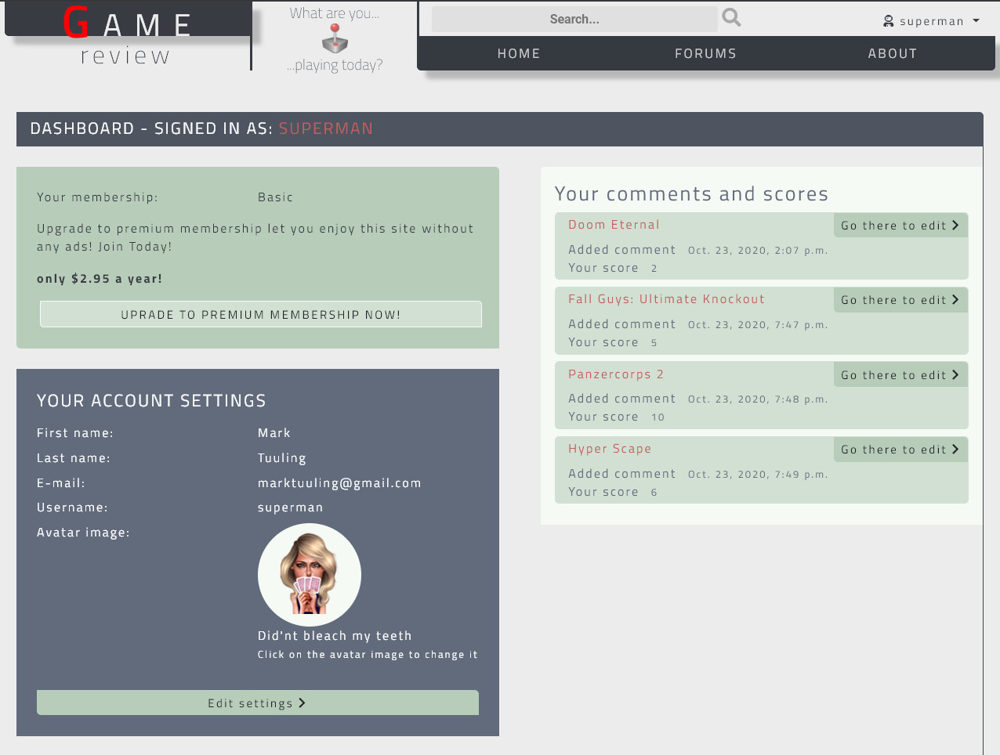
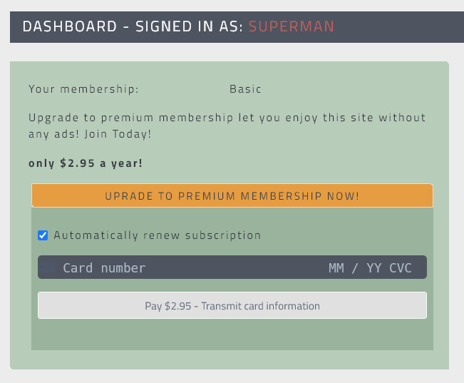
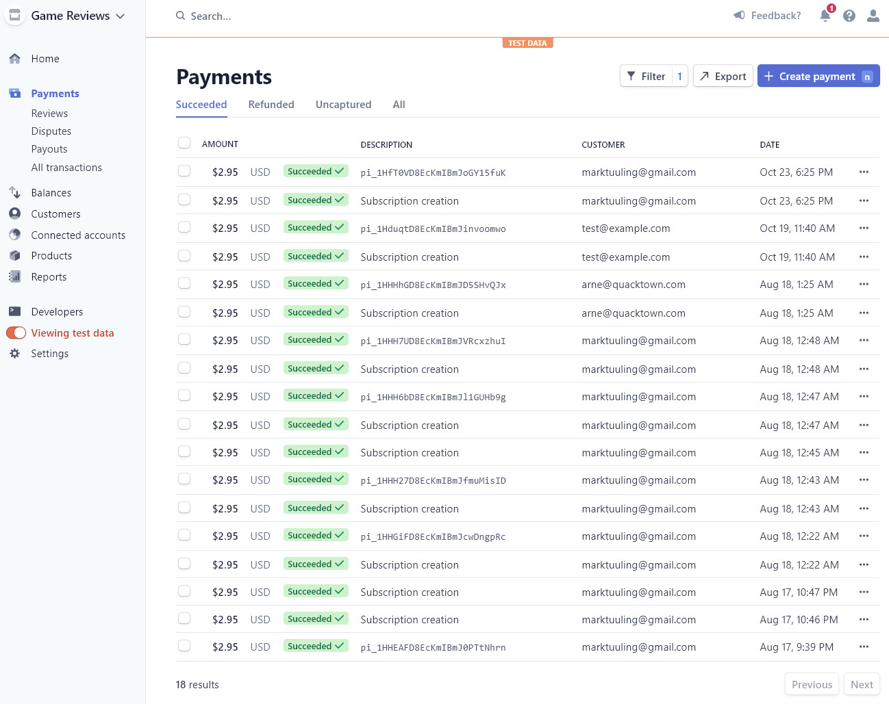

# GAME REVIEWS

## A game database - Game reviews meta scores

### A Code Institute student project

## SUMMARY

This project aims to build a computer and console- games reviews database. In its essence it will hold a list of recent games being released for PC, Xbox- and Playstation-consoles. Each game will have it's score presented, calculated from average review scores from popular gaming sites around the world. It will also hold a short summary of the game content, tags to describe genre and themes etc. Release date, developer, publisher, short quotes from the game sites and links to those review sites. Also links to sites where the games can be bought.

See this as a sort of portal for gamers where they can get quick and easy information about the most recent games (In time older games can be added to the db a well), and from where they navigate further to each of the real game review sites if interested or to a site where they actually can buy the game. It is service for gamers wishing to get some overview of what is available and what is to come.

Besides the Meta score derived from professional reviews, a user can also add their own score for a game and also further add their own comments to a game in a specific game details page. The score shown in the list will be filtered either purely based on the professional scores by default (possibly also purely on the users own scores, or all together). Each game should have it's own discussion board where users can share their scores, views and experience from that particular game.

## FEATURES

### LIST OF GAMES

The home/index page contains a list of games. In a compact view the user can get some quick oversight information. Both "More Reviews" and "Read more" expands the view to show more information. The overall score presented is the total average score for the game based on all the collected professional reviews.

----------------------------------------------------------------

A set of ordering and filtering options are available. For the moment order by score or release date, filter by release date and by Genre tags.

----------------------------------------------------------------

The more compact list of games look like this on mobile devices.

----------------------------------------------------------------

### GAME DETAILS

Each game has it's own details page (accesable from the games list clicking the "Games details" button). Here the user can get more of the same (information about the game) and see other users comments and scores for the given game. Logged in users can also add their own comment and score. The overall user score presented is the total average of scores users have given the game (users not giving a score excluded)

----------------------------------------------------------------

### USER PROFILE

Users signed in (authenticated with Django-Allauth) are presented with a simple menu in the top right corner. The users can from here access their personal user profile page or sign out.

In the user profile page the users can see and access all of the comments and scores they submited for various games. The user profile also contains the normal account settings where the user can add/adit their personal information and also change their avatar picture as their representation in comments.

In here the user can also become a premium member (it is planned to skip the ads for future versions). A click on the upgrade button reveal a previous hidden element with the credit card form.

Succesfull payment redirects the user to a thank you page...

... and the payment service is handled by stripe.

## USER STORIES

### Authentication / User details

As a user i wish to:

-   Register a new account
-   Log in to my account
-   Log out from my account
-   Access my personal profile and see my activities.

### Games information

As a user I wish to:

-   Get a overview (list) of games (name, release date score, genre, theme, developer/publisher, short critics quotes, game description)
-   Be able to sort my games list (by release date or score)
-   Be able to filter list (by release date intervals or by genre/theme tags)
-   Get links to the reviews where I can read more
-   Get all full details (all expanded) of a game in a games details page
-   Add my own scores and comments to a game (In game details page)
-   See other users scores and comments about a game (In game details page)

### Other features

As a user I wish to:

-   Be able to skip ads by becoming a premium member (payment per month)

## TECHNOLOGIES USED

-   HTML 5
-   CSS 3 (Bootstrap 4.5.0, Popper 16.0, fontawesome 5.13.1)
-   JAVASCRIPT (JQuery 3.5.1, popper 1.16.0, bootstrap 4.5.0)
-   Python 3.8.5
-   Postgres Db (deployed on Heroku)
-   Amazon AWS S3 bucket for media- and static storage
-   Stripe API for payment services
-   Google Fonts
-   Font Awesome
-   GitHub for version control
-   Heroku for deployment
-   Visual Studio Code 1.46.1 as IDE
-   Google Chrome 84.0.4147.89 (and development tool)
-   GIMP 2.10.14 for image manipulation

On Heroku you need to set up a postgres db and add all required environment variables.

You also need somewhere to store media files. I use S3 from Amazon AWS.

## DEPLOYMENT

### Clone this project to your own working directory:
1. In this repository (as you’re reading this readme in it :-) on the top right click the green “Code” button
2. Copy the given url by clicking on the copy icon (or open it up with GitHub Desktop if you have it installed)
3. In your local IDE open Git Bash (or whatever terminal you use to work with Git)
4. Change the current working directory to the location where you want the clone to be created
5. In the terminal type “git clone” and the paste the url you just copied
6. Press Enter. Your local clone will be created in the working directory you’re currently in

### Set up your local IDE
You need the latest version of Python 3 installed and then you need to run command “pip install -r requirements.txt” to install all the necessary packages.
You also need to set up a Stripes payment account and a Amazon AWS S3 bucket. Create a env.py file and give it the following information:
os.environ["SECRET_KEY"] = Django secret key
os.environ["STRIPE_PUBLISHABLE_KEY"] = Stripe publishable key
os.environ["STRIPE_SECRET_KEY"] = Stripe secret key
os.environ["STRIPE_PLAN_ANNUALY_PROD_ID"] = Stripe product id
os.environ["STRIPE_PLAN_ANNUALY_PRICE_ID"] = Stripe annually price id
os.environ["DATABASE_URL"] = Heroku postgreSQL databas URI
os.environ["USE_LOCAL_DB"] = '1' [1=PostgreSQL on localhost, 2=SQLite on localhost, any other value Heroku postgreSQL.
os.environ["LOCAL_DB_PASSWORD"] = Password PostgreSQL on localhost
os.environ["AWS_ACCESS_KEY_ID"] = AWS User access key
os.environ["AWS_SECRET_ACCESS_KEY"] = AWS User secret key
os.environ["USE_AWS"] = '1'
os.environ["EMAIL_HOST_PASS"] = Password to chosen email SMTP server
os.environ["EMAIL_HOST_USER"] = User name for chosen email SMTP server
os.environ["USE_CONSOLE_MAIL"] = '1' [1=For development,  Any other = External SMTP
os.environ["DEBUG_MODE"] = '0' [1=Debug mode, Any other = Debug set to false]
You are now ready to work with this project on your local machine.

### Deploy on Heroku
1. First you need to create an account on Heroku
2. Create a new app (Chose region depending on where you live)
3. In your new app create a Heroku PostgreSQL in “Resources”
4. Set the config variables (in accordance with the env.py file described above under “Settings”
5. You can either deploy the project by connecting Heroku to your GitHub repository (follow the instructions on Heroku site)
Or use the Heroku CLI (Install the Heroku CLI from here)
6. Once Heroku CLI is installed, login to Heroku by typing “heroku login” in the CLI and you will be redirected to a web browser window where you log in.
7. Then use Git to clone (app name) source code to your local machine (even if it is already cloned this must be done again). Type: “$ heroku git:clone -a (name of repository you are using)” in the CLI
8. Make this new dir (name of repository) your working directory with command "cd (name of repository)"
9. Make some small change to the code you just cloned in order to be able to push it to Git
10. Stage all files for commit to Git with the command “git add .” + enter
11. Commit to Git with “commit -m (Some commit message)“ + enter
12. Finally in the CLI type "git push heroku master"
...In a while after a lot of stuff flying past you on the screen has stopped flying past you, the project should be deployed

## TESTING

## TESTING
The test is done manually in the following browsers:
-   Google Chrome 84.0.4147.89 (on PC Windows 10)
-   Microsoft Edge Chromium 84.0.522.44 (on PC Windows 10)
-   Firefox 78.0.2 (on PC Windows 10)
-   Safari (on iPad pro 10.5 iOS 13.6.1)
If any of these browsers cause any issues it is mentioned specific under each userstory below. Otherwise all tests have followed the same procedure 
 
The testing is done from the perspective of each user story (presented above) in regards of functionality and responsiveness to various screen sizes.

### In general

- On the games_list page: Bad responsivity on smaller mobile devices (User neeed to side scroll a bit) - No time for measurement at this time. 

### User account

#### Register a new account

Test procedure

1. Click on sign-up link in nav-menu
2. Sign-up form page opens
3. Error messages for faulty input
4. Account created on successful submit

Result: 

1. Ok functionality all browsers, Custom form not applied
2. Ok functionality all browsers. Custom form not applied.
3. Ok functionality all browsers. Custom form not applied.
4. Ok functionality all browsers. Custom form not applied.

Measures: 

The issue with the custom forms not applying needs to be fixed, but since they function as normal, for this release there is no time

#### Sign in to existing user account

Test procedure:

1. From the main nav-menu the user clicks on "sign in" link
2. Sign-in form opens
3. Error messages for faulty input
4. On successfull submision of the form the user gets redirected to home page. T
5. The username and the special user dropdown menu in the top right corner is visible
6. sign-up and sign-in links or no longer visible in the nav-menu
7. User profile page is accesable
8. User can add/change user settings and select a new avatar image
9. New game comments show on user profile page

Result: 

1. Ok functionality all browsers, Custom form not applied
2. Ok functionality all browsers. Custom form not applied.
3. Ok functionality all browsers. Custom form not applied.
4. Ok functionality all browsers. 
5. Ok functionality all browsers.
6. Ok functionality all browsers.
7. Ok functionality all browsers.
8. Ok functionality all browsers. Issue with server error when the user try to change the username to an already existing username.
9. Ok functionality all browsers.

Measures: 

The issue with the custom forms not applying needs to be fixed, but since they function as normal, for this release there is no time
The same goes for change username issue in point 8

#### Sign out of existing user account

Test procedure

1. From the special user dropdown menu in the top right corner the user clicks the option "logout"
2. A separate page with a logout button opens
3. The User clicks the logout button and is redirected to the home page.
4. The username and the special user dropdown menu in the top right corner is no longer visible
5. sign-up and sign-in links is now visible visible in the nav-menu

Result: 

1. Ok functionality all browsers, 
2. Ok functionality all browsers. Custom form not applied 
3. Ok functionality all browsers. 
4. Ok functionality all browsers. 
5. Ok functionality all browsers. 

Measures: 

The issue with the custom forms not applying needs to be fixed, but since they function as normal, for this release there is no time

### Games Information

#### Get a overview (list) of games (name, release date score, genre, theme, developer/publisher, short critics quotes, game description)

Test procedure

1. The list of games is loading correctly?
2. All intended information is visible?
3. All links are working?
4. All look as intended?

Result: 

1. Ok all browsers, 
2. Ok all browsers.
3. Ok all browsers.
4. Ok all browsers. Small issue on smallest screens where some side scrolling is needed.

Measures:

No measures for this release.

#### Be able to sort my games list (by release date or score)

1. By date desc
2. By date asc
3. by score desc
4. by score asc

Result: 

1. Ok all browsers, 
2. Ok all browsers.
3. Ok all browsers.
4. Ok all browsers.

#### Be able to filter list by release date intervals

1. All time
2. Last week
3. Last months
4. Last 3 months
5. last 6 months
6. last year

Result: 

1. Ok all browsers, 
2. Ok all browsers.
3. Ok all browsers.
4. Ok all browsers.
5. Ok all browsers.
6. Ok all browsers.

#### 

## UX

### Strategy / Business goal

The core business goal is to drive traffic that in turn can generate revenue streams from advertising and other affiliate programs (I.e Amazon). Users that wish to not get advertising messages can become premium members where they pay a monthly fee.

In order to get this traffic, the site of course needs to add value to the user. There are other sites existing doing some meta score presentation, but in my own opinion they always try to do too much, resulting in a bit confusing and messy experience where the overview is not that great. This site aims to be clean and simple. It is purely about gamers getting an overview of what games are available at the moment, what are they about, what genre and theme, what the professional critics think about them, what other gamers think about them etc. No more, no less. In that sense it should be clean of other clutter (except some necessary adds as part of the business model of course)

## CREDITS

### Media

#### Joystick
@ https://www.pinclipart.com/pindetail/xhJmw_clip-art-black-and-white-download-file-gnome/

#### Landing image
@ freepik @ https://www.freepik.com/free-photo/close-up-blurred-guy-holding-controller_5121535.htm#page=1&query=game%20controller&position=18

#### User Avatars
@ Alex Gallego @ https://www.coroflot.com/alexgallego/Poker-player-game-avatars

#### Incognito Avatar Image
vecktorstock.com @ https://cdn1.vectorstock.com/i/1000x1000/50/30/user-icon-male-person-symbol-profile-avatar-vector-20715030.jpg

#### The Witcher in the Djungle
@ https://www.zastavki.com/pictures/originals/2014/Games_Jungle_in_the_game_The_Witcher_086356_.png

### Code

#### Extend user profile
@ https://simpleisbetterthancomplex.com/tutorial/2016/07/22/how-to-extend-django-user-model.html#onetoone

#### Stripe payment
@ https://www.youtube.com/watch?time_continue=110&v=Bq5lR5WQNOw&feature=emb_logo
